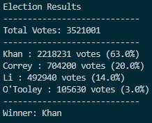

# Python Polls

PyPoll is one of the first Python homework assignments that I completed at the Columbia University Data Analytics Bootcamp. In this assignment, I extracted a .csv file from a local path and used a for loop to iterate through polling data to determine the winner candidate. After the candidate has been selected, then the code will print out a .txt file containing analyses of polling data which includes the number and percentage of votes each candidate received.

### Analysis Results

The results indicate that Khan has won the election with 63% of the total votes.
A sample of the terminal output is below:

